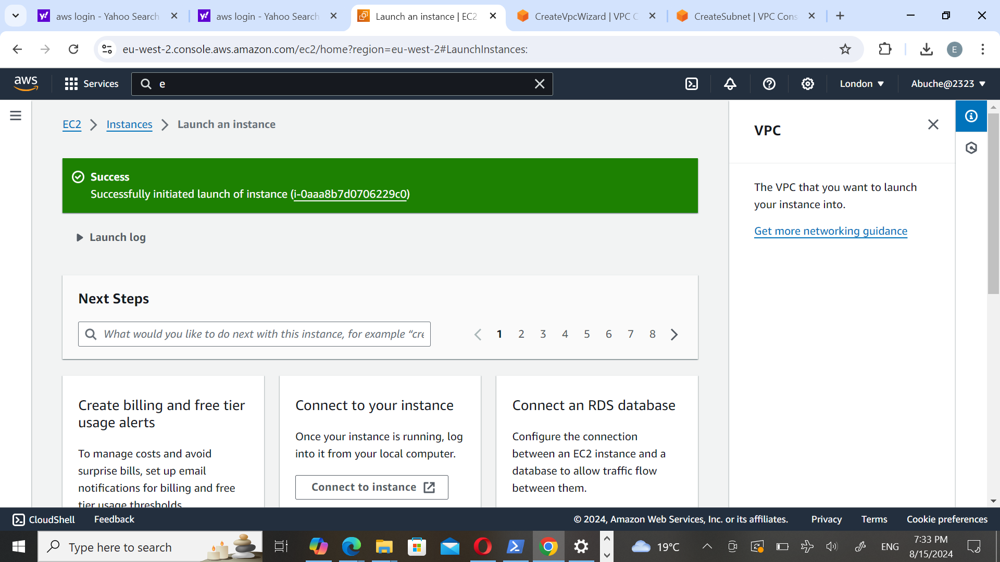
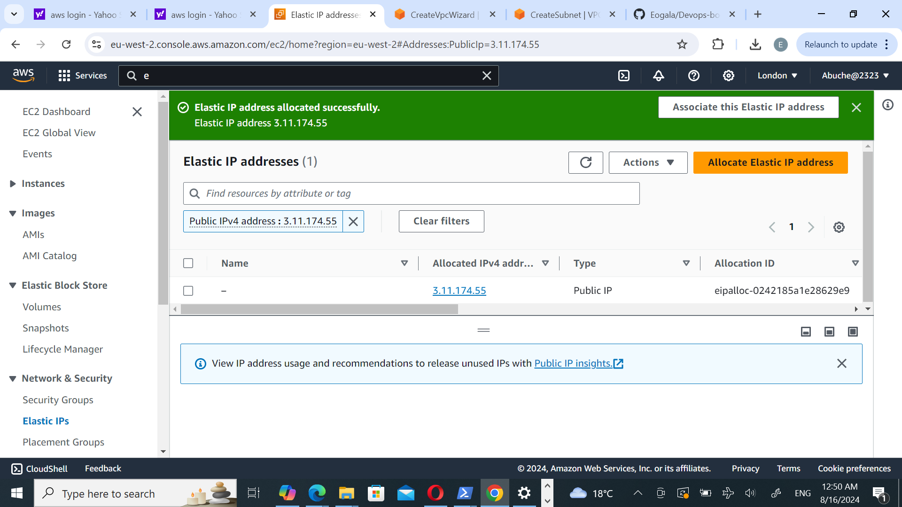

# Documentation
## Create a directory and image folder in VScode
Named folder devops bootcamp where a file (project1.md) was created
## git init to turn directory into resipository

synchronisze Vscode with Github by pushing from local device to github
![2] (img/2.png)
![3] (img/3.png)
## Create Ubuntu server clicking on Ec2 from AWS console

Lunch instance and create keypair name

Enable SSH, HTTP, and HTTPS access, then proceed to click Launch instance

- Click on the **created instance**.

Copy the command provided under SSH client.

**Open a terminal in the directory where your .pem file was downloaded, paste the command and press Enter.**

## Create And Assign an Elastic IP
Return to your AWS console and click on the menu icon to open the dashboard menu.Select Elastic IPs under Network & Security

**How to obtain the website template URL from tooplate.com:**

